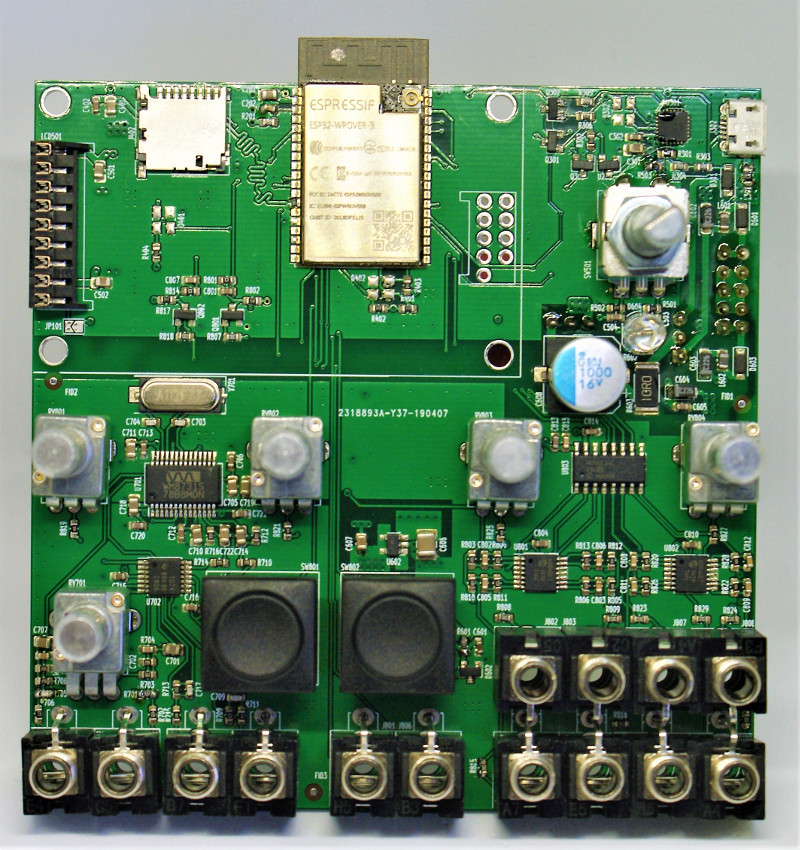
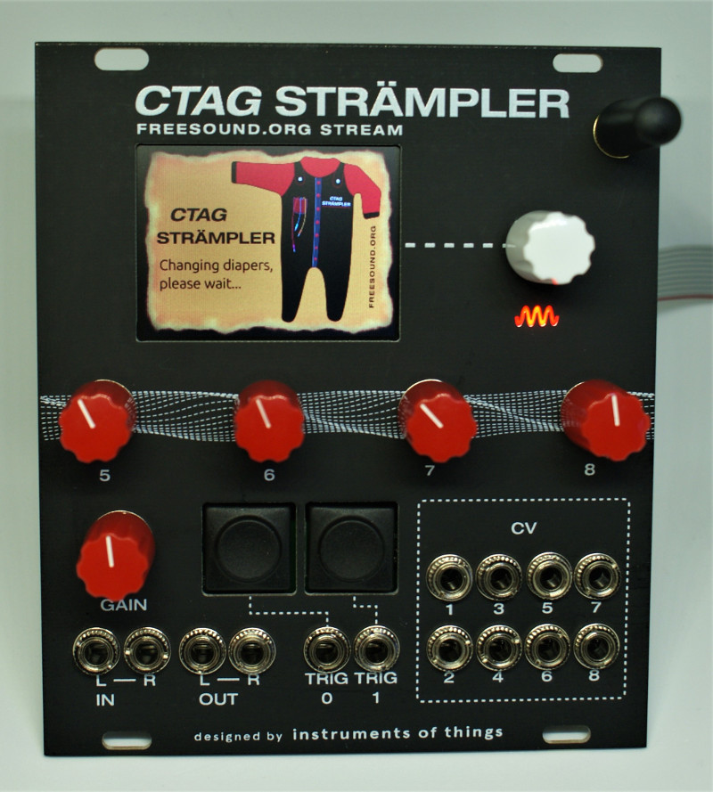

# ESP32 Eurorack Audio Synthesis Module
Harware for Strämpler

## What it is
Base board (design with KiCad) for using the ESP32 WROVER module in the context of real-time audio applications for eurorack synthesizer setups.

## Errata
CV in 1+2 are -1.5V .. 5.5V

## License
Licensed under CC BY-NC-SA 4.0
https://creativecommons.org/licenses/by-nc-sa/4.0/
(C) Robert Manzke 2019

